# RespiRate
RespiRate is an easy-to-use tool for measuring the respiration rate of
laboratory mice from videos. Requiring nothing more than standard Windows
utilities and (optionally) spreadsheet software such as Excel or LibreOffice, it
provides the following features:
 - Point-and-click interface for easy use.
 - User-defineable start time and length of measurement.
 - Graphs of the mice's respiration over the entire measurement period.
 - Calculation of the respiratory rate of one or more mice, along with the
 standard deviation.
 - The option to export video name, mouse ID, start and end times, length of
 measurement, and the calculated data to a spreadsheet for easy review.

Existing technologies require both expensive equipment and physical manipulation
of the mice, and do not allow "capture once, analyze anywhere." With RespiRate,
nothing more is required than a standard Windows 7 (or higher) computer and a
video of lab mice at rest. You can calculate their respiratory rate at any
location, at any time.

## Installation
We provide prebuild Windows installers at
https://github.com/MDA-Courtyard/RespiRate/releases.

Use RespiRate_x64.exe for Windows 64-bit, and RespiRate_x32.exe for Windows
32-bit.
    
## Using RespiRate
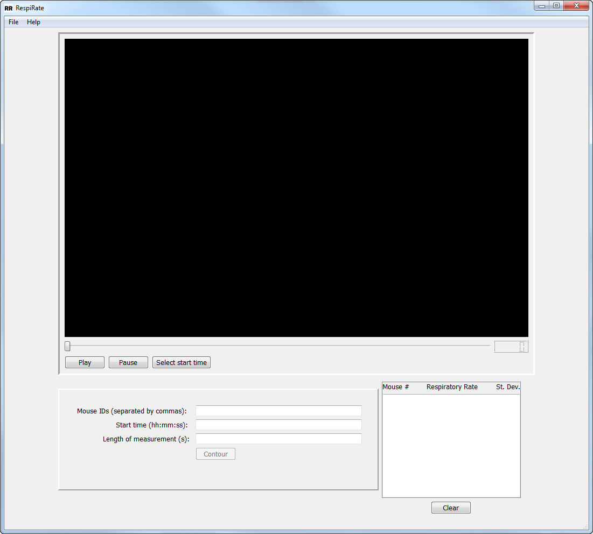  
This is the main program window, where the video is loaded. From here, you can
provide several required inputs, control the program, and check the results of
each measurement.
   
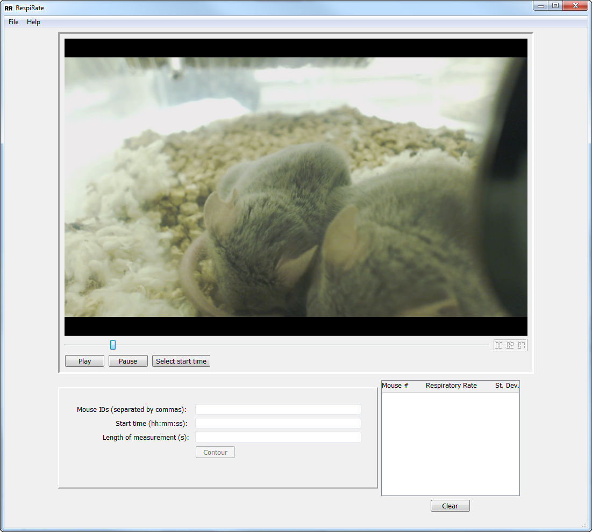  
First, select the video you want to measure by selecting the File menu, then
choosing “Open Video” and navigating to the video. It will automatically be
loaded in the main window. You can pause it at any time and resume playback, or
skip with the slide bar.

   
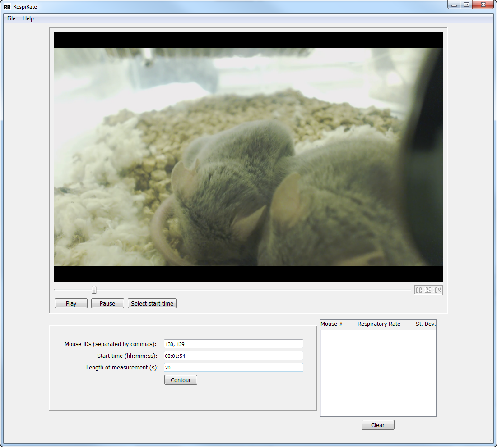  
Now fill in the available fields: `Mouse IDs`, `Start Time`, and
`Length of measurement`. For the Mouse IDs, you can use any naming convention
you want, but you must type as many names/IDs as the number of mice you wish to
contour. Start Time should be in hh:mm:ss format, and Length of measurement is
in seconds. Should you accidentally type a start time or length of measurement
that the program is unable to use, you will be alerted by a pop-up notification
(see [Error Detection](#error-detection) section).

It is important to choose a start time and a length of measurement relatively
free of mouse motion or degrading artifacts; otherwise, the measurement may be
significantly inaccurate.

Once all three fields are filled, you will be able to select the “Contour”
button.
   
  
After pressing “Contour,” a second window will appear. Use the cross-hairs to
define a region on one mouse that you want to be analyzed, using left-click to
define each vertex of the region. If you want to undo a left-click, press the
“u” key. To close the region, use a right-click.

Once you are satisfied with the region, press q.

 
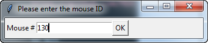  
Provide the ID of the mouse you have just contoured. You will need to use the
ID you want to appear in the returned data.

   
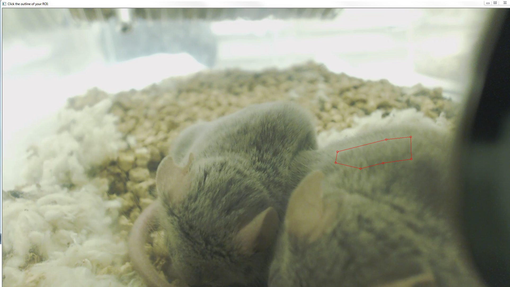
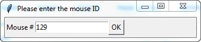  
If you have provided more than one mouse in the “Mouse IDs” field of the main
window, you will now be able to define the analysis regions on each of the
remaining mice, following the same steps as above.

   
  
After contouring the last mouse, the program will begin to calculate the
respiration rate of each mouse. You will see a third window with individual
points on each mouse actively tracking the motion of that mouse throughout the
time period previously defined in “Length of measurement” field in the main
window.

   
  
After the measurement is completed, the mouse ID, respiration rate, and standard
deviation of each mouse is printed in the main window for easy review.

From here, you can define a new start time or length of measurement for the
current video, or load a new video.

After running the program several times, the output box may become full. Simply
click the “Clear” button to clear its contents.

   
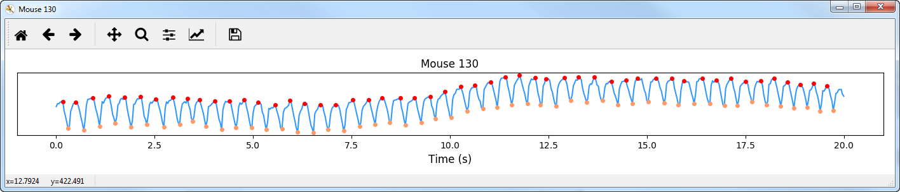
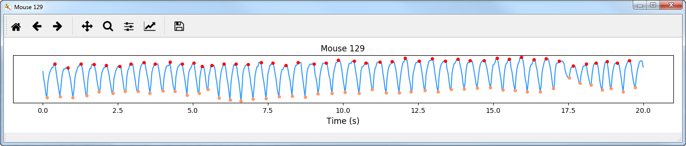  
After the measurement is completed, the respiration rate of each mouse will be
plotted as a function of time, with each detected inhale as a peak and each
exhale as a valley.

   
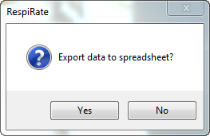  
You should be prompted if you want to export the raw data to a spreadsheet named
“output1.xls” to allow additional or later research and analysis. The data that
will be exported is the video name, the mouse ID, the start and end times, the
total times, the best detected respiration rate, and the standard deviation.

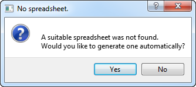 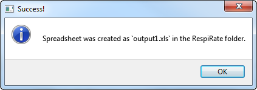  
If you choose to export the data and a suitable spreadsheet is not found in the
current working folder, you will be prompted to generate one automatically. This
will occur on the first run of the program.  

## Error Detection
RespiRate comes with robust error-checking functionality to detect user-input
mistaked or runtime errors that would cause it to fail.

   
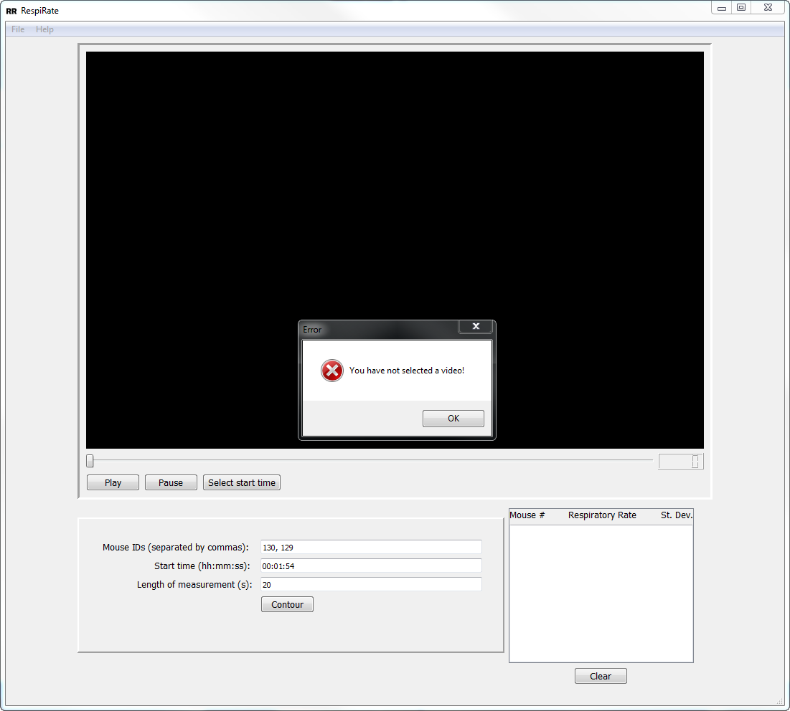  
If the video did not load correctly or was not selected at all, you will be
prompted when pressing the “Contour” button to go back and select a video from
the File menu.

   
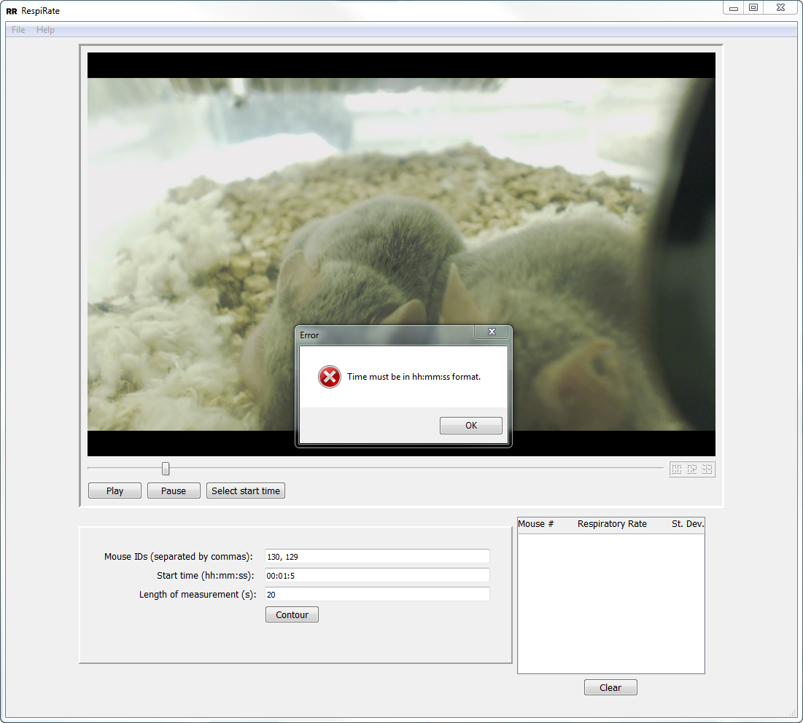  
If the time is not in strict HH:MM:SS format, you will be prompted after
pressing the “Contour” button. You must change the time to the required format.

You will be similarly warned if the “Length of measurement” field is not in a
format the program understands, such as “20s” instead of “20”.

   
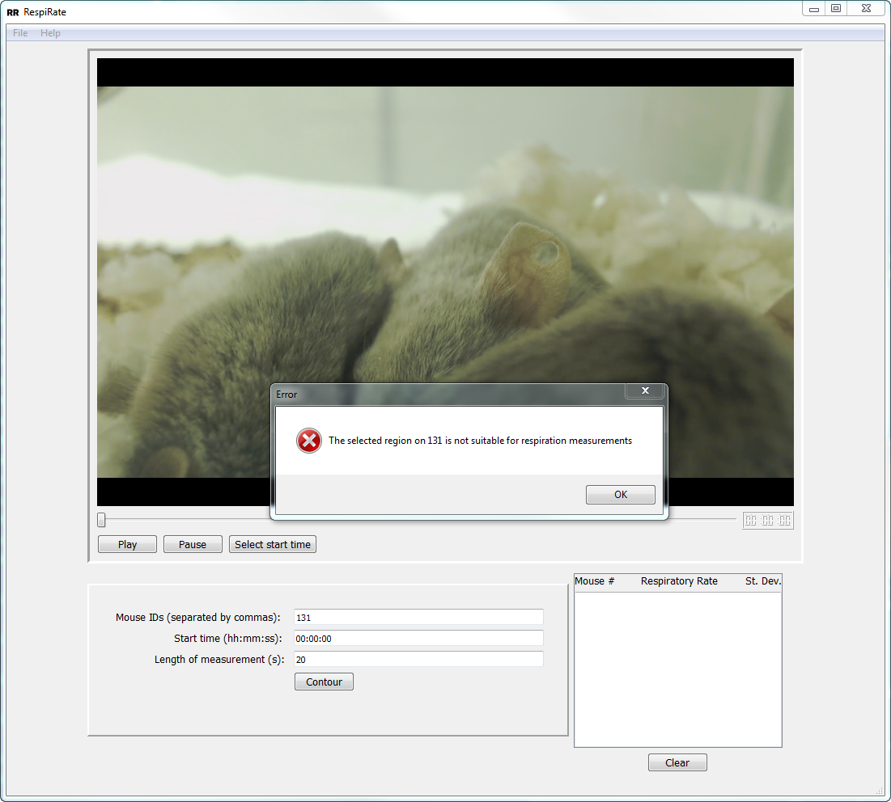  
If you have selected a region on a mouse that is not suitable for respiratory
measurements, such as a region in which the camera is out of focus, the program
will stop running with a warning.

   
## Licensing
RespiRate is copyright 2017 by A. Rubinstein and S. Gay. All source and binary
files, with the exception of the opencv_ffmpeg dll files, are provided under the
MIT license. The opencv_ffmpeg dll files are copyright by Fabrice Bellard and
licensed under the LGPL.

See [COPYING.md](Copying.md) for licenses and a list of all contributors.
